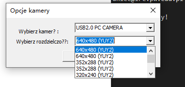
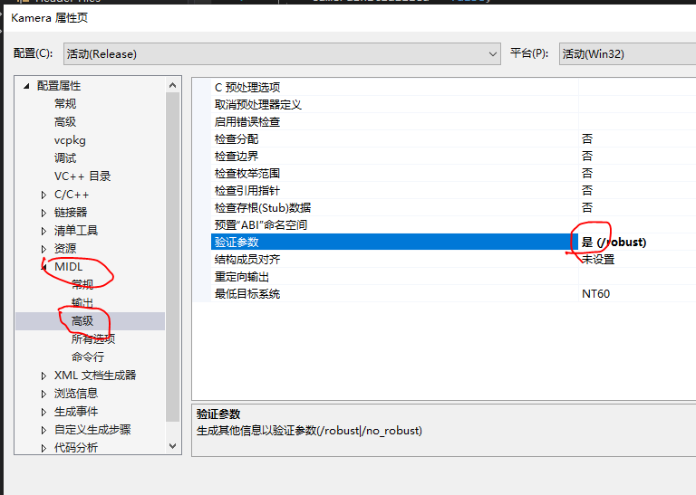

# Kamera
用于获取 USB 摄像头分辨率信息， 以及开启摄像头并捕获和显示内容。

Windows only。

## 直接使用

上传了编译好的 [Kamera/Release/Kamera.exe](Kamera/Release/Kamera.exe)。

## 自行编译
原版工程获取自 https://github.com/martakuzak/ASOD1， 是 vs2010 工程。

可用 VS2019 打开，并按如下修改后成功生成和运行：

**note1**
VS 需要安装 MFC 组件。

**note2**
VS 需要修改工程属性， MIDL -> 高级 -> 验证参数， 从“否”改为“是”：

**note3**
VS 需要使用 Release 方式编译， 若使用 VS2013 或更新版本， Debug 版本报错提示 atlsd.lib 找不到， 需要使用 atls.lib（繁琐）， 切到 Release 则可链接生成。

就可以生成 GUI 程序了。

## 原版版权

Copyright to Jacek Naruniec, 
Warsaw University of Technology, Institute of Radioelectronics
Poland
e-mail: J.Naruniec@ire.pw.edu.pl

For non commercial use only!